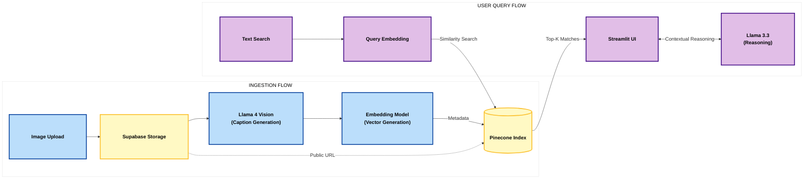

# Multi-modal RAG-driven Digital Asset Manager

**An end-to-end engineering solution for semantic search and conversational reasoning over unstructured image libraries.**

[](https://bkqz-digital-asset-manager.hf.space)

---

## System Architecture & Rationale

This project addresses the challenge of retrieving unstructured visual data through a **decoupled RAG (Retrieval-Augmented Generation) architecture**. By separating heavy vision inference from low-latency vector search, the system remains scalable and responsive.

### High-Level Architecture



### Engineering Decisions
*   **Vision Inference**: Utilizes **Llama-4-Scout via Groq's LPU™** technology. I chose Groq to achieve sub-second caption generation, which is typically the bottleneck in multimodal pipelines.
*   **Vector Orchestration**: Employs **Pinecone Serverless** for a 768-dimensional index. Pinecone was selected for its native support of metadata filtering and horizontal scaling.
*   **Persistent Storage**: **Supabase Storage** provides cloud-native asset hosting, ensuring that retrieved results are accessible via high-speed CDNs rather than local disk.

---

## Implementation Details

### 1. Asynchronous Ingestion Pipeline
The ingestion flow is designed as a linear ETL (Extract, Transform, Load) process:
- **Storage**: Binary data is persisted to a public Supabase bucket to generate a permanent URI.
- **Cognition**: The image URI (or base64) is passed to Llama-4-Scout to generate a semantic description.
- **Embedding**: The description is vectorized using `all-mpnet-base-v2`, mapping the image into a 768-dimensional latent space.
- **Sink**: The resulting vector, URI, and original caption are upserted into Pinecone.

### 2. Retrieval & Reasoning (RAG)
To move beyond simple search, I implemented a **Search-then-Reason** loop:
1.  **Similarity Search**: User queries are embedded in real-time and matched using Cosine Similarity.
2.  **Context Injection**: Top-$k$ matches are retrieved, and their captions are injected into a prompt as "Ground Truth" context.
3.  **Synthesis**: A Llama-3.3-70b model processes the query against this context, ensuring that the AI's responses are strictly grounded in the user's actual image library.

---

## Deployment & Local Setup

### Prerequisites
- Python 3.11+
- Docker
- API keys: Groq, Pinecone, Hugging Face, Supabase.

### Environment Configuration
Configure your `.env` file:

```bash
# Vector DB
PINECONE_API_KEY=your_key
PINECONE_HOST=your_host_url # Omit https://
PINECONE_INDEX_NAME=digital-asset-manager

# LLM & Embeddings
GROQ_API_KEY=your_key
HF_TOKEN=your_token

# Cloud Storage
SUPABASE_URL=your_project_url
SUPABASE_KEY=your_anon_key
SUPABASE_BUCKET_NAME=assets
```

### Containerized Execution
The project uses a **multi-stage Docker build** to minimize image size and improve security by running as a non-root user.

```bash
# Build & Run
docker build -t asset-manager:latest .
docker run -p 7860:7860 --env-file .env asset-manager:latest
```

---

## License
MIT License - Developed as a technical demonstration of multimodal RAG architectures.
